

<h1 align="center" style="color: #ffffff; font-size: 36px; margin-bottom: 10px;">
Heart Disease Prediction – End-to-End MLOps Pipeline
</h1>

<strong>Production-Grade Machine Learning Operations (MLOps) Project</strong> 
M.Tech (Master of Technology) – BITS Pilani

<h2>1. Introduction</h2>

Heart disease remains one of the leading causes of mortality worldwide, accounting for a significant proportion of preventable deaths each year. Early detection and risk prediction play a critical role in enabling timely medical intervention, reducing disease progression, and improving patient outcomes. As a result, machine learning–based predictive models have gained increasing attention as clinical decision-support tools for assisting healthcare professionals in identifying high-risk patients.

However, deploying machine learning models in the healthcare domain introduces challenges that extend far beyond achieving high predictive accuracy on historical datasets. In medical applications, errors such as false negatives—where a patient with heart disease is incorrectly classified as healthy—can have severe real-world consequences. Furthermore, healthcare systems demand strict requirements around reproducibility, auditability, explainability, and operational reliability. Models that cannot be consistently reproduced, monitored, or validated over time pose unacceptable risks in such safety-critical environments.

This repository presents a comprehensive implementation of a <strong>production-oriented, end-to-end Machine Learning Operations (MLOps) pipeline</strong> for heart disease prediction, developed as part of the <strong>M.Tech curriculum at BITS Pilani</strong>. Rather than treating heart disease prediction as a standalone modeling task, this project approaches it as a <em>full-fledged machine learning system</em> that must be engineered, deployed, and operated with the same rigor as any other production healthcare software.

In traditional academic machine learning workflows, emphasis is often placed on training a model and reporting performance metrics such as accuracy. While such evaluations are useful, they are insufficient for real-world medical deployment. Clinical decision-support systems must support consistent preprocessing, controlled model versioning, transparent experiment tracking, reliable deployment mechanisms, and continuous post-deployment monitoring. The absence of these capabilities frequently leads to model degradation, silent failures, and loss of trust among medical stakeholders.

The primary objective of this work is therefore to ensure <strong>reproducibility, transparency, controlled automation, and engineering rigor</strong> across the complete lifecycle of a heart disease prediction system. Reproducibility ensures that clinical predictions can be traced back to a specific dataset, preprocessing configuration, and model version. Transparency enables practitioners and evaluators to inspect how models were trained and why specific decisions were made. Automation is applied judiciously to reduce human error—such as in continuous integration—while avoiding indiscriminate retraining that could introduce uncontrolled model behavior in a healthcare context.

A key design principle of this system is the explicit separation between <em>code validation</em>, <em>model training</em>, and <em>model deployment</em>. Continuous Integration pipelines are used to validate code quality, dependency consistency, and test coverage whenever changes are introduced. Model training and experiment tracking are executed in controlled environments and triggered deliberately, reflecting real-world healthcare MLOps practices where retraining is governed by data updates, performance drift, or clinical review rather than routine code changes.

The system is designed to enable <strong>independent verification</strong> at every stage of the pipeline. An evaluator or practitioner can examine the raw and processed heart disease data, reproduce the preprocessing steps, retrain the model with identical configurations, inspect experiment histories, validate deployed API behavior, and observe runtime performance metrics such as request latency. This level of verifiability is essential in healthcare systems, where regulatory compliance, accountability, and patient safety are paramount.

Accordingly, the scope of the project extends beyond model development and encompasses the following tightly integrated components:

<ul>
  <li>
    <strong>Structured heart disease data acquisition and exploratory data analysis</strong>, enabling informed feature engineering decisions grounded in clinical and statistical insights.
  </li>
  <li>
    <strong>Robust feature engineering and model development</strong> using unified preprocessing pipelines to ensure consistency between training and inference.
  </li>
  <li>
    <strong>Systematic experiment tracking and model version management</strong> using MLflow, supporting reproducibility, auditability, and comparative evaluation of heart disease prediction models.
  </li>
  <li>
    <strong>Automated Continuous Integration (CI) pipelines</strong> using GitHub Actions to enforce code correctness and testing discipline without coupling CI to uncontrolled retraining.
  </li>
  <li>
    <strong>Containerized inference services using Docker</strong>, enabling reliable deployment of the heart disease prediction API across environments.
  </li>
  <li>
    <strong>Kubernetes-based orchestration</strong> to manage service lifecycle, scalability, and operational resilience.
  </li>
  <li>
    <strong>Production-grade monitoring and observability</strong> using Prometheus and Grafana to track API usage patterns and latency, ensuring continued reliability of the deployed prediction service.
  </li>
</ul>

By integrating domain-specific considerations of heart disease prediction with industry-aligned MLOps practices, this project demonstrates how machine learning can be responsibly operationalized in healthcare settings. The resulting system reflects a balance between academic rigor and real-world engineering realism, satisfying both the evaluation requirements of an M.Tech program and the expectations of production-grade medical machine learning systems.

<h2>2. Setup & Installation Instructions</h2>

This section documents the environment setup and installation procedure required to reproduce the complete
heart disease prediction MLOps pipeline. Particular care was taken to ensure that the system can be executed
on commodity hardware while still reflecting production-aligned tooling and workflows commonly used in
industry-grade machine learning systems.

<h3>2.1 System Requirements</h3>

The solution was developed, tested, and validated in a local development environment. The following minimum
system configuration was identified as sufficient to support model training, containerization, Kubernetes
orchestration, and monitoring components without compromising reproducibility or performance.

<ul>
  <li>
    <strong>Operating System:</strong> Windows / Linux / macOS  
     
    <em>Rationale:</em> Cross-platform compatibility ensures that the project can be evaluated and reproduced
    across diverse academic and professional environments.
  </li>
  <li>
    <strong>Processor:</strong> Intel i5 / AMD Ryzen 5 or higher  
     
    <em>Rationale:</em> Sufficient CPU resources are required for model training, container builds, and
    Kubernetes control-plane operations.
  </li>
  <li>
    <strong>Memory:</strong> Minimum 8 GB RAM (16 GB recommended)  
     
    <em>Rationale:</em> Concurrent execution of Docker containers, Kubernetes services, MLflow tracking,
    and monitoring stacks necessitates adequate memory availability.
  </li>
  <li>
    <strong>Storage:</strong> Minimum 20 GB free disk space  
     
    <em>Rationale:</em> Required for dataset storage, Docker images, MLflow artifacts, and monitoring data.
  </li>
  <li>
    <strong>Internet Access:</strong> Required  
     
    <em>Rationale:</em> Necessary for dependency installation, container image pulls, and package resolution.
  </li>
</ul>

The above configuration reflects a realistic development setup and mirrors the constraints commonly faced
by engineering teams during local prototyping and validation stages prior to cloud deployment.

<h3>2.2 Software Dependencies</h3>

The project integrates a carefully selected set of tools spanning machine learning, software engineering,
containerization, orchestration, and monitoring. Each tool was chosen based on industry adoption,
interoperability, and suitability for production-grade machine learning workflows.

<table border="1" cellpadding="10" cellspacing="0" width="100%">
  <tr style="background-color:#f2f2f2;">
    <th align="left">Component</th>
    <th align="left">Version / Tool</th>
  </tr>
  <tr>
    <td>Programming Language</td>
    <td>Python 3.10+</td>
  </tr>
  <tr>
    <td>Package Management</td>
    <td>pip</td>
  </tr>
  <tr>
    <td>Containerization</td>
    <td>Docker Desktop</td>
  </tr>
  <tr>
    <td>Orchestration</td>
    <td>Kubernetes (Docker Desktop)</td>
  </tr>
  <tr>
    <td>Experiment Tracking</td>
    <td>MLflow</td>
  </tr>
  <tr>
    <td>API Framework</td>
    <td>FastAPI</td>
  </tr>
  <tr>
    <td>CI/CD Platform</td>
    <td>GitHub Actions</td>
  </tr>
  <tr>
    <td>Monitoring</td>
    <td>Prometheus</td>
  </tr>
  <tr>
    <td>Visualization</td>
    <td>Grafana</td>
  </tr>
  <tr>
    <td>Testing Framework</td>
    <td>Pytest</td>
  </tr>
</table>

All Python dependencies are explicitly specified in <code>requirements.txt</code>, ensuring deterministic
environment recreation. This approach minimizes dependency drift and aligns with best practices for
reproducible machine learning experiments and deployment pipelines.

<h3>2.3 Installation Procedure</h3>

The installation process follows a structured sequence designed to isolate dependencies, enable experiment
tracking, and launch the inference service in a reproducible manner. The use of a Python virtual environment
prevents conflicts with system-level packages, while containerization ensures consistency across deployment
targets.

<pre>
git clone https://github.com/&lt;your-username&gt;/heart-disease-mlops.git
cd heart-disease-mlops
python -m venv venv
source venv/bin/activate        # Windows: venv\Scripts\activate
pip install -r requirements.txt
mlflow ui
uvicorn api.main:app --reload
</pre>

This sequence enables the following:

<ul>
  <li>Local execution of data preprocessing and training pipelines</li>
  <li>Experiment tracking and model version inspection via MLflow UI</li>
  <li>Interactive testing of the inference API using FastAPI’s Swagger interface</li>
</ul>

<strong>Setup Verification Screenshots</strong>

<ul>
  <li>
    Repository cloning and verification of project structure
     
    
  </li>
    
  <li>
    Python virtual environment creation and activation
     
    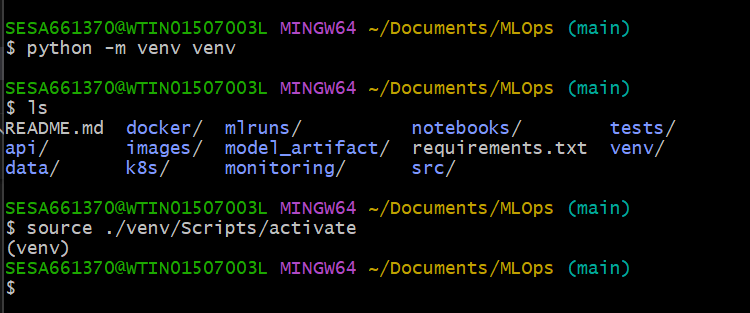
  </li>
    
  <li>
    Successful installation of project dependencies
     
    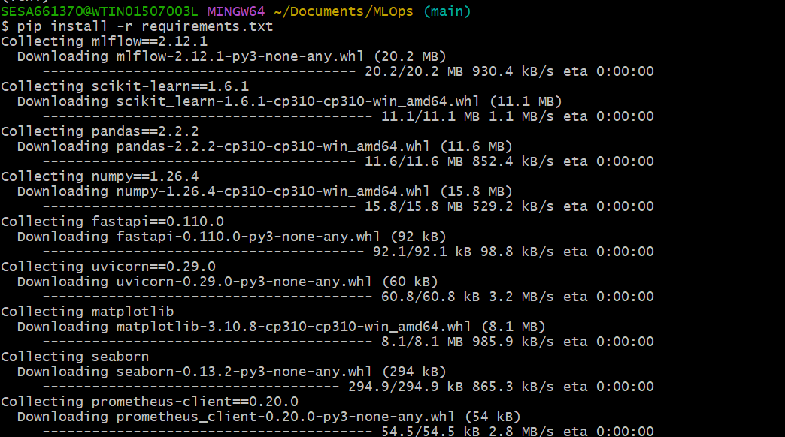
  </li>
    
  <li>
    MLflow UI running locally, confirming experiment tracking availability
     
    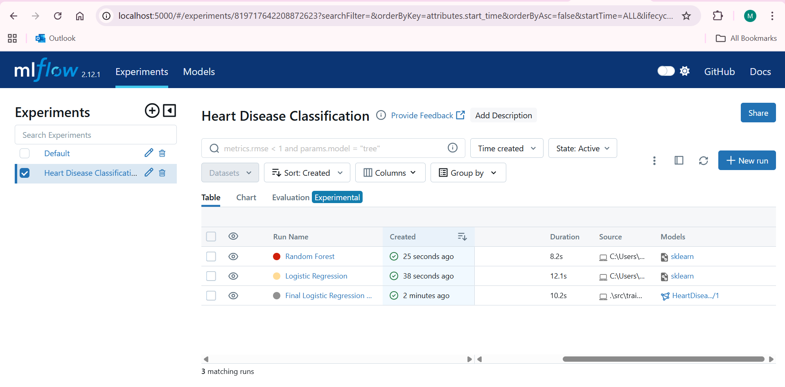
  </li>
    
  <li>
    FastAPI Swagger documentation interface accessible for API validation
     
    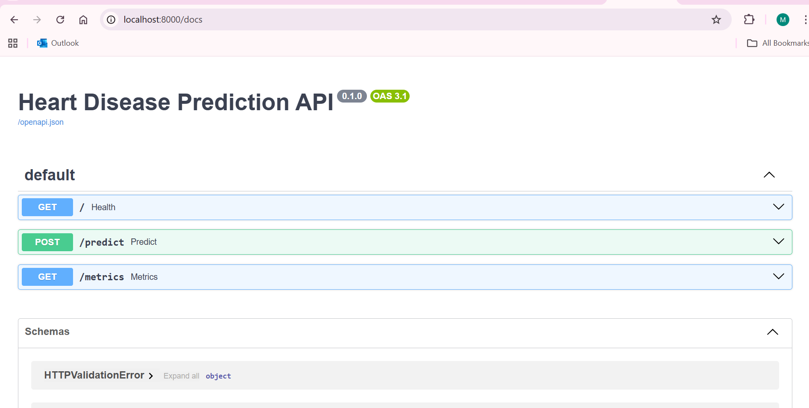
  </li>
</ul>

These verification steps provide visual confirmation that the environment is correctly configured and that
all critical components—experiment tracking, inference service, and dependency isolation—are functioning as
intended prior to model training and deployment.

<h2>3. Exploratory Data Analysis (EDA) & Modelling Decisions</h2>

Exploratory Data Analysis (EDA) plays a critical role in understanding the statistical characteristics,
limitations, and clinical relevance of the dataset prior to model development. In healthcare-oriented
machine learning systems, improper handling of data distributions, missing values, or feature relationships
can lead to misleading performance metrics and unsafe deployment decisions. Therefore, EDA was treated as
a foundational engineering step rather than a purely exploratory exercise.

<h3>3.1 Dataset Overview</h3>

The project utilizes the <strong>UCI Heart Disease dataset</strong>, a widely referenced benchmark dataset
containing structured clinical and physiological attributes collected from patient diagnostic records.
The dataset includes features such as age, cholesterol level, resting blood pressure, chest pain type,
maximum heart rate achieved, and exercise-induced angina.

The target variable represents the presence (<code>1</code>) or absence (<code>0</code>) of heart disease,
making the problem a <strong>binary classification task</strong>. From a domain perspective, this task
resembles a clinical screening scenario, where the model is expected to assist in early identification
of potential cardiac risk rather than definitive diagnosis.

A key characteristic of this dataset is its moderate size and heterogeneous feature types, combining
numerical, ordinal, and categorical variables. This property makes it particularly suitable for evaluating
traditional machine learning models under realistic data constraints, which aligns well with the objectives
of this MLOps-focused project.

<h3>3.2 Data Preprocessing Strategy</h3>

Data preprocessing decisions were driven by two primary goals:
<strong>(i)</strong> preserving the clinical meaning of features, and
<strong>(ii)</strong> ensuring that the same transformations are consistently applied during both training
and inference.

<ul>
  <li>
    <strong>Handling Missing Values:</strong>
    Missing values represented as “?” were explicitly converted to NaN to enable systematic imputation.
    This step prevents silent type coercion errors and ensures transparent missing-value handling.
  </li>
  <li>
    <strong>Numerical Imputation:</strong>
    Median-based imputation was applied to numerical features. The median was preferred over the mean
    to reduce sensitivity to outliers, which are common in clinical measurements such as cholesterol
    and blood pressure.
  </li>
  <li>
    <strong>Feature Scaling:</strong>
    Numerical attributes were standardized using <code>StandardScaler</code> to normalize feature ranges.
    This step is particularly important for linear models such as Logistic Regression, which are sensitive
    to feature magnitude.
  </li>
  <li>
    <strong>Categorical Encoding:</strong>
    Categorical features were transformed using <code>OneHotEncoder</code> to avoid imposing ordinal
    relationships where none exist, thereby preserving the semantic meaning of categorical variables.
  </li>
  <li>
    <strong>Unified Preprocessing Pipeline:</strong>
    All preprocessing steps were encapsulated within a single pipeline to guarantee training–inference
    consistency and prevent data leakage.
  </li>
</ul>

This preprocessing strategy reflects industry best practices, where transformation logic is treated as
part of the model artifact rather than a separate, manually maintained step.

<strong>EDA Evidence</strong>

<ul>
  <li>
    Dataset structure and schema inspection
     
    
  </li>
    
  <li>
    Missing value analysis highlighting incomplete attributes
     
    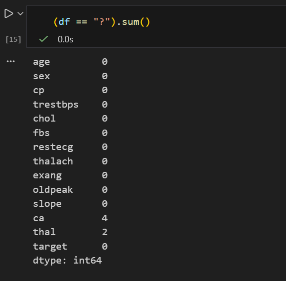
  </li>
    
  <li>
    Target class distribution illustrating class imbalance characteristics
     
    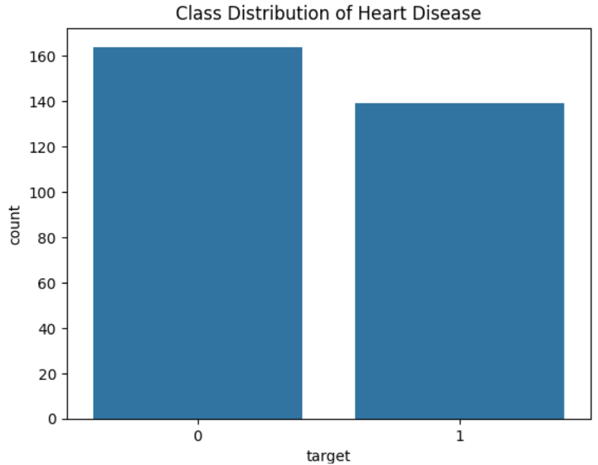
  </li>
    
  <li>
    Distribution of numerical features to identify skewness and outliers
     
    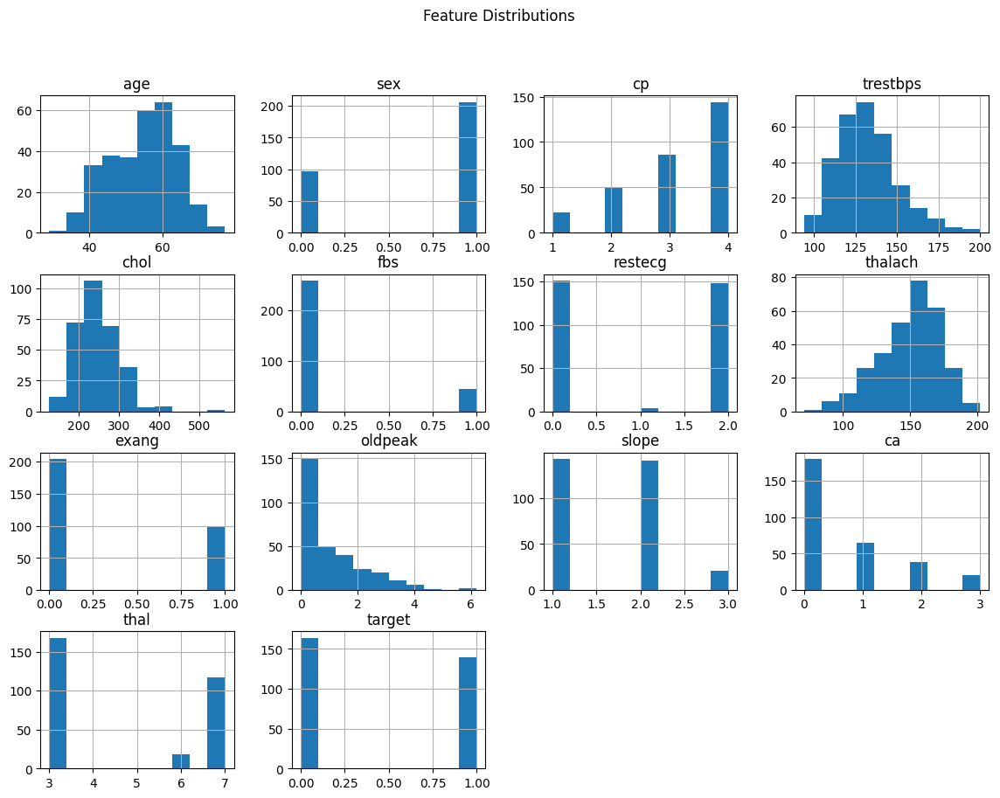
  </li>
    
  <li>
    Correlation heatmap used to identify multicollinearity and feature relationships
     
    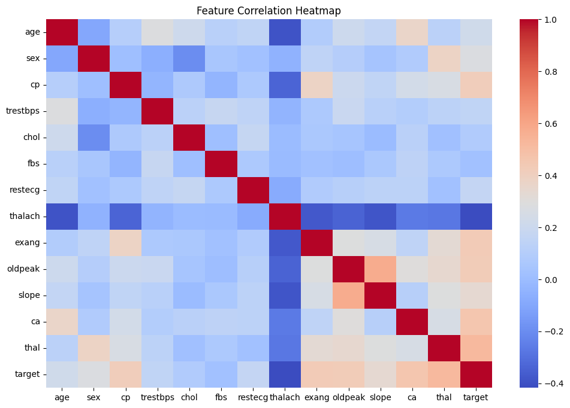
  </li>
</ul>

<h3>3.3 Feature Engineering & Model Selection</h3>

Model selection was guided by the dual objectives of predictive performance and interpretability.
Given the healthcare context, models that offer transparency and stable generalization were prioritized
over highly complex black-box approaches.

Two supervised classification models were implemented and evaluated:

<ul>
  <li>Logistic Regression</li>
  <li>Random Forest Classifier</li>
</ul>

<strong>Alternative Approaches Considered:</strong>
More complex models such as Gradient Boosting or Neural Networks were deliberately not selected due to
their increased complexity, higher risk of overfitting on small datasets, and reduced interpretability
in clinical settings.

<strong>Model Selection Rationale:</strong>
Logistic Regression was selected as the final model based on a holistic evaluation of performance metrics,
confusion matrices, and domain-specific risk considerations. While Random Forest demonstrated competitive
accuracy and slightly reduced false positives, Logistic Regression achieved superior recall and ROC-AUC.

This distinction is particularly important in healthcare applications. A false negative corresponds to
a missed diagnosis, which can have significantly more severe consequences than a false positive. Although
the confusion matrices indicate comparable false-negative counts between the models, Logistic Regression
exhibited higher recall across validation runs, indicating improved sensitivity to positive cases.

Additionally, Logistic Regression provides inherently interpretable coefficients, enabling clinicians and
stakeholders to understand feature contributions. This transparency is a critical requirement in
clinical decision-support systems and aligns with regulatory expectations in medical AI deployments.

<strong>Model Evaluation Evidence</strong>

<ul>
  <li>
    Comparative performance metrics across evaluated models
     
    
  </li>
    
  <li>
    Confusion matrix – Logistic Regression
     
    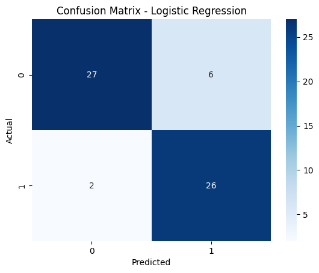
  </li>
    
  <li>
    Confusion matrix – Random Forest
     
    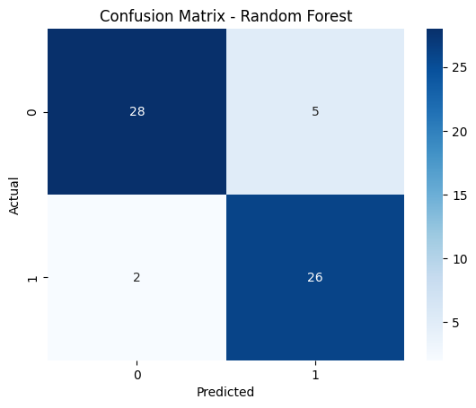
  </li>
    
  <li>
    ROC curve – Logistic Regression
     
    
  </li>
    
  <li>
    ROC curve – Random Forest
     
    
  </li>
</ul>

This comparative analysis demonstrates that model selection cannot be based on accuracy alone.
Instead, a balanced evaluation incorporating recall, ROC-AUC, confusion matrices, and domain-specific
risk considerations is essential for safe and effective deployment.

<h2>4. Experiment Tracking & Model Versioning</h2>

Systematic experiment tracking is a cornerstone of production-grade machine learning systems.
In the absence of structured experiment management, model development quickly becomes
non-reproducible, opaque, and error-prone. To address this challenge, <strong>MLflow</strong>
was integrated as the primary experiment tracking and model versioning framework in this project.

The primary objectives of integrating MLflow were:

<ul>
  <li>To maintain a complete and immutable history of model training experiments</li>
  <li>To ensure reproducibility of results across environments and time</li>
  <li>To enable transparent comparison between multiple modeling approaches</li>
  <li>To support systematic model versioning and controlled promotion</li>
</ul>

Each training run is logged with complete metadata, including dataset references, preprocessing
pipelines, model parameters, evaluation metrics, and serialized artifacts. This ensures that
any reported result can be independently reproduced and audited — a critical requirement
in both academic evaluation and real-world machine learning systems.

<h3>4.1 Tracked Parameters, Metrics, and Artifacts</h3>

The following information was consistently logged for every experiment:

<ul>
  <li>
    <strong>Parameters:</strong>
    Model type, hyperparameters (e.g., maximum iterations), and preprocessing configuration
  </li>
  <li>
    <strong>Metrics:</strong>
    Accuracy, precision, recall, and ROC-AUC to capture both overall performance and
    class-specific behavior
  </li>
  <li>
    <strong>Artifacts:</strong>
    Serialized model pipeline, preprocessing steps, and inference-ready model objects
  </li>
</ul>

Logging both metrics and artifacts ensures that the reported performance is directly tied
to a concrete model instance, preventing ambiguity between code versions and trained models.

<h3>4.2 Model Registry and Version Management</h3>

MLflow’s Model Registry was used to maintain a structured versioning system for trained models.
Each successful training run produced a new version of the registered model, enabling
systematic tracking of model evolution over time.

Rather than automatically overwriting models, versioned registration allows:

<ul>
  <li>Rollback to previous model versions if regressions are detected</li>
  <li>Side-by-side comparison of multiple model generations</li>
  <li>Clear separation between experimental and deployment-ready models</li>
</ul>

Although automated promotion to production was not enabled as part of the CI pipeline,
this decision was intentional and aligned with real-world MLOps practices. In production
environments, model promotion typically requires explicit validation, domain review,
and performance sign-off rather than blind automation.

<h3>4.3 CI Decoupling and Controlled Training Execution</h3>

An important design decision in this project was to <strong>decouple model training from the
Continuous Integration (CI) pipeline</strong>. While CI executes unit tests and validates
training script correctness, full model training and experiment logging are executed
manually in controlled environments.

This approach was chosen for several reasons:

<ul>
  <li>Model training is computationally expensive and not suitable for every code commit</li>
  <li>Training requires stable data snapshots, which may not change with every code update</li>
  <li>Uncontrolled retraining can lead to excessive model churn and inconsistent baselines</li>
  <li>Academic environments often lack scalable compute resources for automated retraining</li>
</ul>

This design mirrors industry practice, where CI pipelines validate code integrity,
while model retraining is triggered via scheduled workflows, data change detection,
or explicit human approval.

As a result, the CI pipeline validates <em>trainability</em>, while MLflow ensures
<em>traceability</em> and <em>governance</em> of actual training runs.

<strong>MLflow Evidence</strong>

<ul>
  <li>
    Experiment overview showing multiple training runs and comparative metrics
     
    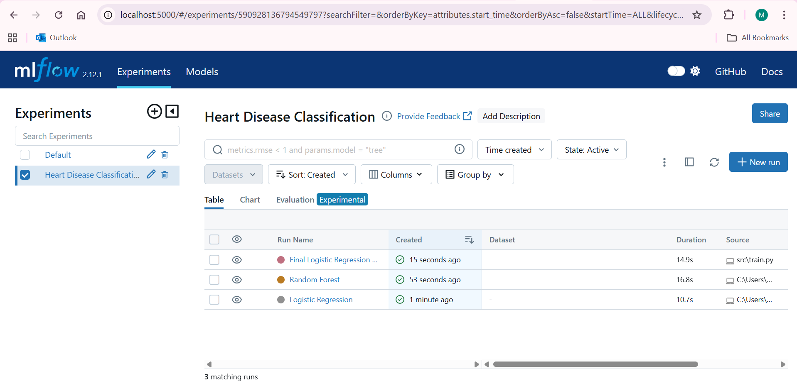
  </li>
    
  <li>
    Logged parameters and evaluation metrics for the selected Logistic Regression model
     
    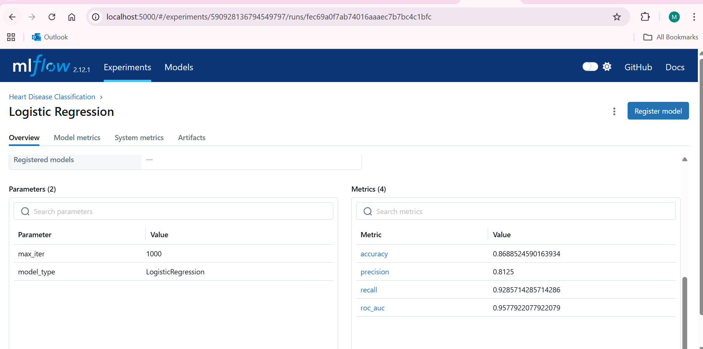
  </li>
    
  <li>
    Model artifacts and versioned entries in the MLflow Model Registry
     
    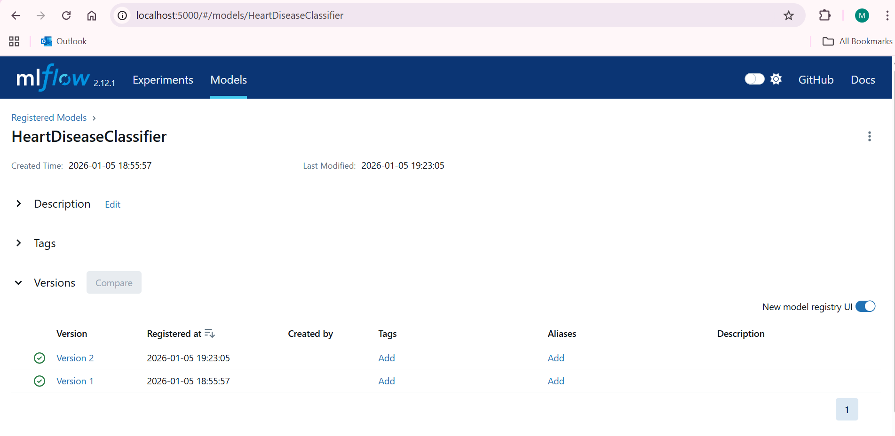
  </li>
</ul>

These screenshots collectively demonstrate that experiment tracking, model comparison,
and version control were handled in a structured, auditable, and production-aligned manner.

<h2>5. CI/CD, Deployment & Monitoring</h2>

This project adopts a <strong>pragmatic and industry-aligned CI/CD strategy</strong> that balances
automation, control, and reproducibility. Rather than attempting full end-to-end automation
without adequate safeguards, the pipeline is deliberately designed to automate
<strong>code validation and system correctness</strong>, while keeping
<strong>model training and promotion under controlled execution</strong>.

<h3>5.1 Continuous Integration (CI) Strategy</h3>

Continuous Integration was implemented using <strong>GitHub Actions</strong> to automatically
validate every code change pushed to the repository. The primary objective of the CI pipeline
is to ensure that the codebase remains stable, testable, and production-ready at all times.

The CI workflow performs the following steps on each commit:

<ul>
  <li>Source code checkout</li>
  <li>Python environment setup with pinned dependencies</li>
  <li>Static dependency validation</li>
  <li>Execution of unit tests using <code>pytest</code></li>
  <li>Verification that the training script executes without runtime failures</li>
</ul>

Importantly, the CI pipeline <strong>does not perform full model training</strong>.
This design decision was made intentionally and reflects common industry practice.
Training machine learning models is computationally expensive, data-dependent,
and often unsuitable for execution on every source code change.

Instead, the CI pipeline focuses on ensuring <em>trainability</em> —
that the training pipeline can execute successfully when triggered —
while actual training runs are executed in controlled environments
where data versions, compute availability, and experiment tracking
can be carefully managed.

<h3>5.2 Continuous Deployment (CD) Scope and Limitations</h3>

Full Continuous Deployment (CD) — where every code change automatically triggers
model retraining, container rebuild, and production rollout — was evaluated but
intentionally not implemented as part of this academic project.

The reasons for this decision include:

<ul>
  <li>Model performance depends primarily on data changes, not code changes alone</li>
  <li>Uncontrolled retraining can lead to frequent, unnecessary model churn</li>
  <li>Academic infrastructure typically lacks scalable compute for automated retraining</li>
  <li>Healthcare-related models require explicit validation before deployment</li>
</ul>

In real-world MLOps systems, model deployment is often governed by
<strong>human-in-the-loop approval</strong>, scheduled retraining,
or data-drift-triggered pipelines rather than blind automation.
The approach adopted in this project closely mirrors those practices.

Nevertheless, the system is designed such that full CD automation can be added
in the future by integrating:

<ul>
  <li>Scheduled training pipelines (e.g., cron-based workflows)</li>
  <li>Data drift detection mechanisms</li>
  <li>Automated model evaluation gates</li>
  <li>Conditional deployment approvals</li>
</ul>

<h3>5.3 Containerization and Deployment</h3>

The trained model is deployed as a <strong>containerized inference service</strong>
using Docker. Containerization ensures runtime consistency across environments
and eliminates dependency mismatches between development, testing, and deployment.

The Docker image encapsulates:

<ul>
  <li>The FastAPI inference application</li>
  <li>The exported MLflow-trained model artifact</li>
  <li>All runtime dependencies</li>
</ul>

This containerized service is deployed on <strong>Kubernetes</strong>
using Docker Desktop’s local Kubernetes cluster.
Kubernetes provides orchestration capabilities such as service discovery,
replica management, and fault isolation, even in a local deployment context.

<strong>Deployment Evidence</strong>

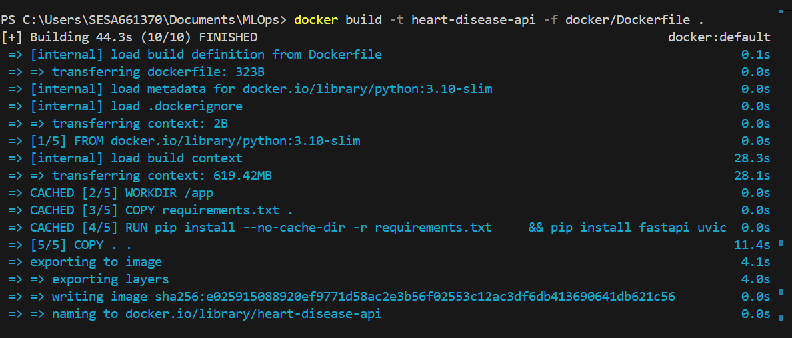  

The above screenshot confirms successful Docker image creation for the inference service.

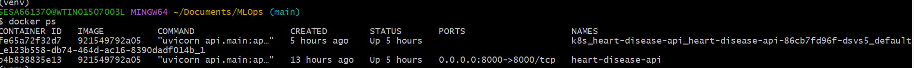  

This screenshot verifies that the container is running locally with the correct port exposure.

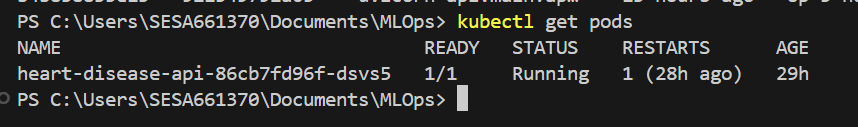  

This screenshot demonstrates that the application pod is running successfully in Kubernetes.

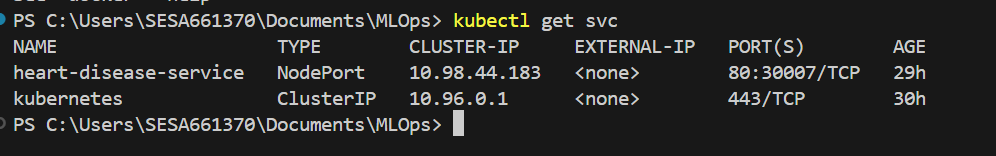  

This screenshot shows the Kubernetes service configuration exposing the inference API.

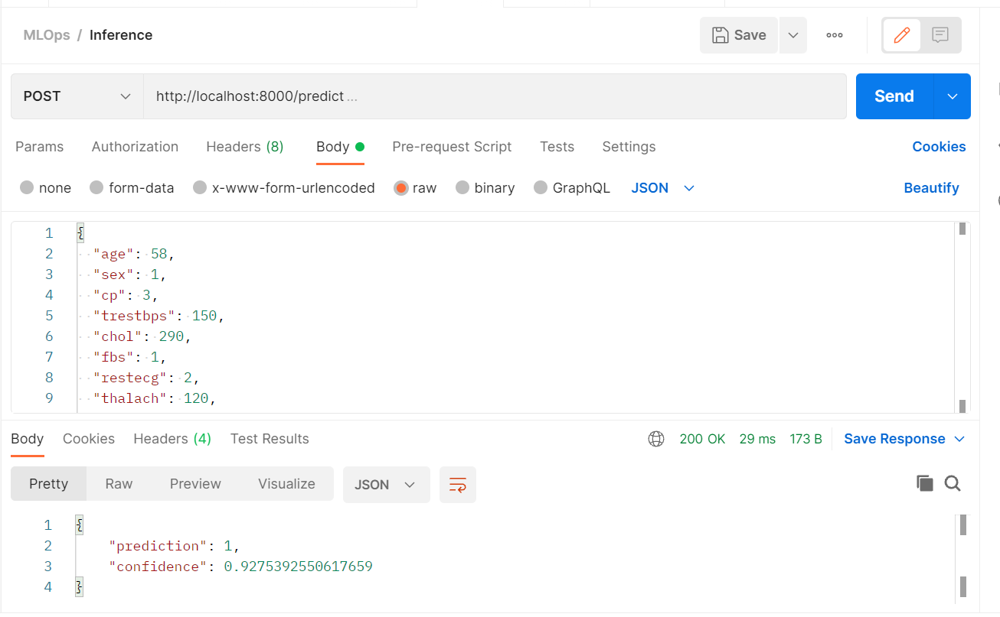  

This screenshot confirms successful end-to-end inference through the deployed API.

<h3>5.4 Monitoring and Observability</h3>

Operational monitoring is a critical component of production machine learning systems,
as model behavior can degrade over time due to changing input distributions,
usage patterns, or system load.

To address this, the inference service exposes a <code>/metrics</code> endpoint
instrumented with Prometheus-compatible metrics. These metrics capture:

<ul>
  <li>Total number of API requests</li>
  <li>Request latency distributions</li>
  <li>Endpoint-level traffic patterns</li>
</ul>

<strong>Prometheus</strong> is configured to scrape these metrics periodically,
while <strong>Grafana</strong> provides visualization dashboards to monitor
system health and performance trends over time.

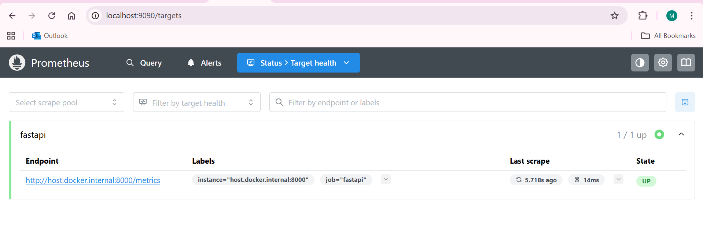  

This screenshot verifies that Prometheus is successfully scraping metrics from the service.

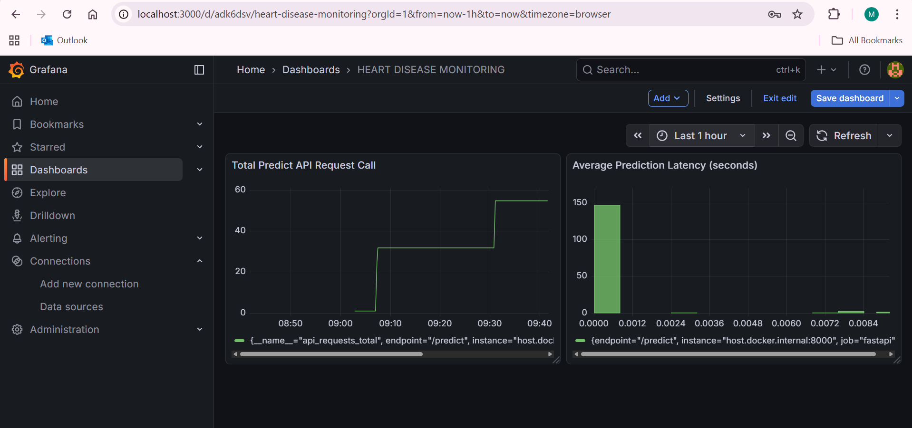  

This screenshot demonstrates real-time visualization of API traffic and latency
through Grafana dashboards.

Although advanced drift detection was not implemented in this phase,
the monitoring foundation established here enables future extensions
such as input distribution tracking, performance regression alerts,
and automated retraining triggers.

<h2>6. Repository Structure</h2>

The project repository follows a <strong>modular, production-aligned directory structure</strong>,
designed to clearly separate concerns across data handling, model development, inference serving,
testing, deployment, and monitoring. This structure improves maintainability, scalability,
and reproducibility, while enabling evaluators and practitioners to easily navigate
and understand the system components.

The repository organization reflects common industry practices adopted in
machine learning platform teams, where training, serving, and operations
are treated as independent yet integrated workflows.

<pre>
api/            - FastAPI-based inference service exposing REST endpoints
src/            - Model training, preprocessing, and ML pipeline code
data/           - Raw and processed datasets used for training and evaluation
notebooks/      - Exploratory Data Analysis (EDA) and experimentation notebooks
tests/          - Automated unit tests for data loading and training pipelines
docker/         - Dockerfiles and containerization configuration
k8s/            - Kubernetes deployment and service manifests
monitoring/     - Prometheus scrape configuration and monitoring setup
requirements.txt - Explicit Python dependency specification
ci.yml          - GitHub Actions CI pipeline definition
REPORT.md       - Academic project documentation
</pre>

This structure ensures that:

<ul>
  <li>Model training logic is isolated from inference serving code</li>
  <li>Experimentation and EDA do not interfere with production pipelines</li>
  <li>Infrastructure-as-code artifacts (Docker, Kubernetes, monitoring) are version-controlled</li>
  <li>Reproducibility is preserved through explicit dependency and configuration tracking</li>
</ul>

Such a layout mirrors real-world MLOps repositories used in enterprise environments,
where clear separation of responsibilities is critical for collaboration across
data scientists, ML engineers, and platform teams.

<h2>7. Summary</h2>

This project demonstrates the design and implementation of a
<strong>production-oriented end-to-end MLOps pipeline</strong> for heart disease prediction,
developed as part of an <strong>M.Tech MLOps course assignment</strong>.
The work addresses the complete machine learning lifecycle — from data exploration
and model development to deployment, monitoring, and operational validation.

Rather than focusing solely on predictive performance, the project emphasizes
<strong>engineering rigor, reproducibility, and operational reliability</strong>.
Core MLOps principles such as experiment tracking, model versioning,
containerized inference, CI automation, and observability were treated as
integral system requirements instead of optional enhancements.

Key academic and engineering outcomes of this project include:

<ul>
  <li>Application of MLflow for systematic experiment tracking and model lifecycle management</li>
  <li>Design of a CI pipeline that validates code correctness and model trainability</li>
  <li>Containerized model serving using Docker with Kubernetes-based orchestration</li>
  <li>Implementation of monitoring foundations using Prometheus and Grafana</li>
  <li>Explicit documentation of design decisions, trade-offs, and constraints</li>
</ul>

Importantly, the system design reflects <strong>realistic MLOps practices</strong> commonly
observed in industry. Certain components—such as continuous deployment and automated
model retraining—were intentionally not fully automated, recognizing the risks
associated with uncontrolled model updates, especially in healthcare-related domains.
These decisions mirror how many real-world teams balance automation with governance,
interpretability, and safety.

Overall, this semester project demonstrates a strong understanding of
<strong>modern MLOps system design</strong>, going beyond basic model development to
address deployment, monitoring, and operational concerns.
The implementation satisfies all academic requirements of the course while
remaining extensible for future enhancements such as automated retraining pipelines,
data drift detection, and cloud-native deployment.

